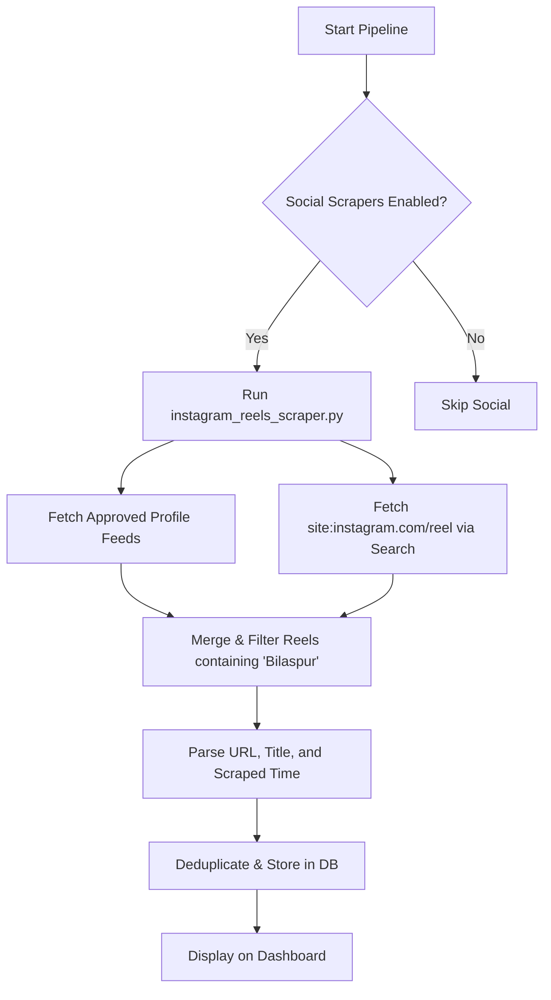

# Instagram Reels Scraping — Strategy & Architecture Plan

This document outlines the methods, challenges, and proposed architecture for integrating **Instagram Reels** monitoring into the Bilaspur News Agent.

---

## 1. Objectives

- **Target Content**: Instagram Reels (short videos) posted by local news channels, influencers, government handles, and public hashtags (e.g., `#bilaspurnews`, `#bilaspurcity`).
- **Data to Extract**: Reel URL, caption/description, poster username, publication date, view count (if available), and thumbnail image.
- **Integration Goal**: Display Reels in a dedicated "Reels/Videos" section on the dashboard with a link or embed code.

---

## 2. Scraping Methods: Comparison & Analysis

Scraping Instagram is notoriously challenging due to Meta's aggressive anti-scraping systems. Below are the four main methods evaluated for this project:

### Option A: Playwright Browser Scraper (Hashtag / Search Page)
This approach launches a headless browser to scrape `https://www.instagram.com/explore/tags/bilaspurnews/` or search pages.
- **Pros**: 
  - Completely free.
  - Can fetch real-time view counts, poster usernames, and direct video links.
- **Cons**: 
  - **Login Wall**: Instagram block public viewing of hashtags or explore pages after 1-2 page views, forcing a login.
  - **Account Checkpoints**: Using a real account in a scraper can trigger "suspicious login" verification (checkpoints) or account suspension.
  - **DOM Changes**: Instagram dynamically obfuscates CSS class names, requiring robust XPath/ARIA selectors.

### Option B: Playwright Browser Scraper (Profile Monitor)
Instead of searching hashtags, we scrape specific curated local profile feeds (e.g., `@bilaspurdiaries`, `@bilaspur_times`).
- **Pros**:
  - More structured than search/hashtag pages.
  - Easier to select the elements.
- **Cons**:
  - Requires maintaining a list of approved accounts.
  - Still prone to login walls if we scrape frequently.

### Option C: Google Search Scraping (Search Index Fallback)
Query Google Search programmatically using keywords like `site:instagram.com/reel "Bilaspur"` or `site:instagram.com/p "Bilaspur news"`.
- **Pros**:
  - No Instagram login required.
  - Google's index is public, so no rate limits or login blocks from Instagram.
  - Extremely reliable and low-maintenance.
- **Cons**:
  - **Freshness**: Google indexes Reels with a delay (hours or days). It is not real-time.
  - No access to views count or video-specific metadata beyond Google's snippet text.

### Option D: RapidAPI / Free-Tier Third-Party Scraping APIs
Use a hosted Instagram Scraping API (e.g., RocketAPI, Instagram Scraper API on RapidAPI).
- **Pros**:
  - The API provider handles proxies, login sessions, and anti-bot measures.
  - Simple JSON response containing clean Reel data.
- **Cons**:
  - Requires an API key and has rate/monthly usage limits on free tiers.
  - Dependency on external third-party services.

### 2.5 Methods to "Read" and Extract Reel Content (Text & Audio)

To present a readable summary of Reels on the dashboard (so the editorial team does not have to watch every video), we can implement one or more of the following extraction pipelines:

#### A. Caption & Metadata Scraping (Lightweight Text)
- **Process**: Extract the full text caption written by the publisher (found in the `<meta property="og:description">` tag or the post's description DOM elements).
- **Output**: Pure text (e.g., "Municipal corporation launches road repairs in Bilaspur...").
- **Feasibility**: High. This is standard metadata already parsed by Playwright and RapidAPI.

#### B. Speech-to-Text Audio Transcription (Full Content)
- **Process**:
  1. Download the Reel audio track (`.mp3` or `.m4a`) using a lightweight utility like `yt-dlp` or through the direct video source URL obtained via Playwright.
  2. Transcribe the audio using an AI speech-to-text model (like OpenAI's Whisper API via the `openai` client, or a local instance of Whisper/Whisper.cpp).
- **Output**: Full transcribed script of what is spoken in the Reel (supporting Hindi, Chhattisgarhi, and English).
- **Feasibility**: Medium. Whisper API is extremely fast and accurate, costing less than $0.006 per minute of audio.

#### C. Optical Character Recognition (OCR) on Video text (Headline Overlay)
- **Process**:
  1. Download the video and use `ffmpeg` to extract a few key frames (e.g., one frame every 2 seconds).
  2. Run the frames through a python OCR library (like `easyocr` or `pytesseract`) to detect text overlay/subtitles shown on the screen (since news Reels often display prominent text overlays).
- **Output**: Extracted on-screen headlines.
- **Feasibility**: Medium. Requires installing `easyocr`/`tesseract` and `ffmpeg` on the execution host (or installing them in the GitHub Actions runner, which is supported).

#### D. Multimodal LLM Analysis
- **Process**: Feed the extracted caption and the audio transcription into the OpenCode LLM, prompting it to generate a unified 2-sentence Hindi/English summary and flag key entities.
- **Output**: A concise, clean bilingual text summary of the Reel content.
- **Feasibility**: High. Fits directly into the existing `summarizer.py` flow.

---

## 3. Recommended Architectural Choice

We recommend a **hybrid approach**:

1. **Primary Feed Monitoring (Playwright)**:
   - Scrape specific, high-value local Instagram accounts (already defined in `instagram_scraper.py`).
   - Extract links containing `/reel/` or `/p/` (since video posts are also Reels).
   - Use the existing optional login session in `.env` (optional credentials to prevent login walls).
2. **Hashtag Monitoring (Google Search Fallback)**:
   - Run a search query against Google to find recently indexed Reels mentioning "Bilaspur" or "बिलासपुर". This captures new accounts posting about Bilaspur without needing an active Instagram login session.
3. **Data Integration**:
   - Map Reels to `NewsItem` with `category = "video"` or a new category `"social"`.
   - Update `dashboard.py` to display Reels with a beautiful video icon or embedded player using Instagram's official oEmbed or standard iframe embeds.

---

## 4. Implementation Steps

If approved, the implementation will proceed as follows:

1. **Create Scraper Module**: Add `src/sources/instagram_reels.py`.
2. **Update Aggregator**: Register it in `src/aggregator.py` under the `--social` flag.
3. **Dashboard Revamp**: Create an embed view or video indicator for Reels.
